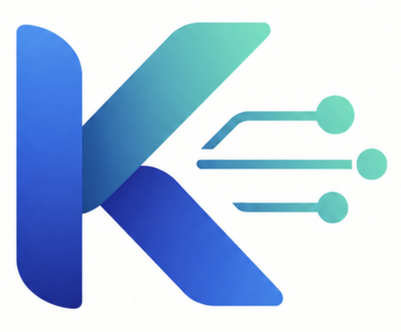
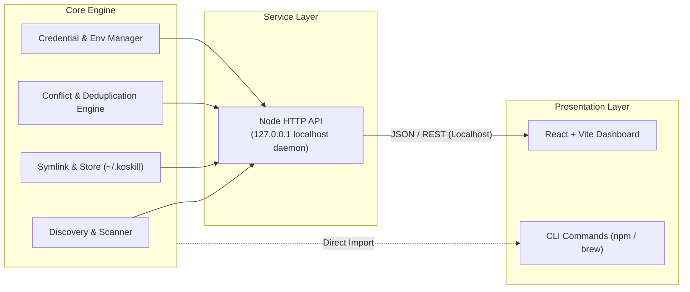

<div align="center">



# KoSkill

**A local management cockpit for AI agent skills and Model Context Protocol (MCP) servers.**

Manage, visualize, deduplicate, and symlink skills across Gemini CLI, AntiGravity, Codex, Claude Code, and Cloud Code.

[](LICENSE)
[](https://nodejs.org)
[](https://vitejs.dev)
[](https://www.typescriptlang.org)
[](docs/technical-guide.md)

[Overview](#overview) • [Architecture](#architecture) • [Features](#features) • [Tech Stack](#tech-stack) • [Getting Started](#getting-started) • [Documentation](#documentation)

</div>

---

## Overview

Modern AI development assistants (Gemini CLI, AntiGravity, Codex, Claude Code) store skills, prompts, and MCP tool definitions across fragmented global directories (`~/.gemini`, `~/.config`, `~/.claude`, etc.).

**KoSkill** provides a centralized control plane and local web dashboard to:
- Discover all installed skills and MCP servers in one unified place.
- Detect duplicate capabilities and naming conflicts.
- Pick preferred tool versions or merge overlapping configs.
- Consolidate configurations into a central home (`~/.koskill`) with automated symlinking.
- Safely manage API credentials without leaving plaintext secrets in unmanaged directories.

---

## Architecture

KoSkill isolates domain logic from presentation layers. The core application services operate independently from the frontend, ensuring the tool can be packaged as an npm CLI first and extended with native terminal commands or Homebrew distribution later.



### Architectural Guarantees

- **Decoupled Core**: Application logic lives in shared core services, not inside React components.
- **Local Security**: Node HTTP daemon binds strictly to `127.0.0.1`, keeping tools and credentials isolated from LAN interfaces.
- **Low Overhead**: Lightweight local Node runtime with negligible resource impact.
- **Clean Distribution**: Ships as an npm CLI utility first (`npx koskill`), with Homebrew formula support planned.

---

## Features

- **Global Discovery**: Automatically scan global and workspace configurations from Gemini CLI, AntiGravity (AGY), Codex, Claude Code, and Cloud Code for skills, custom workflows, and MCP servers.
- **Workflow & Slash Command Support**: Discover and inspect custom slash commands across Gemini CLI (`~/.gemini/config/global_workflows/`, `.agent/workflows/`) and Claude Code (`~/.claude/commands/`, `.claude/commands/`) with dedicated syntax hints and permission views.
- **Model Context Protocol (MCP) Live Discovery**: Proactively probe running MCP servers via the modern stateless `server/discover` JSON-RPC method with graceful fallbacks to legacy `initialize` handshakes and local filesystem `instructions.md` guides, extracting server titles, versions, descriptions, and agent prompt instructions.
- **Central Storage & Symlinking**: Consolidate scattered configurations into `~/.koskill/` and manage symlinks to target environments transparently. Users can pick and choose individual skills, workflows, or MCP servers to centralize or revert back to original configurations with single-click UI controls.
- **Embedded Hybrid Search**: Sub-30ms similarity scoring and lexical search combining `sqlite-vec` dense embeddings and SQLite FTS5 BM25 with Reciprocal Rank Fusion (RRF) at `~/.koskill/cache/index.db`. Automatically indexes skills, custom workflows, and individual MCP tools from both local configs and central registries.
- **Local ONNX Embeddings**: Zero-cloud inference using `@xenova/transformers` (384 dimensions) with lazy loading to guarantee sub-200ms cold starts.
- **Tiered Conflict & Deduplication Engine**: Detect exact name collisions, identical SHA-256 CAS content hashes, colliding MCP tool signatures across servers, semantic duplicates (cosine similarity >= 0.85), and prompt instruction divergences on shared command triggers.
- **Side-by-Side Diff & Resolution UI**: Compare conflicting `SKILL.md` instructions with unified line diffs, similarity match badges (e.g. "94% Match"), and execute atomic `PICK` (keep winner, archive loser), `ALIAS` (rename), or `MERGE` (combine configs) actions with optimistic CAS hash validation and pre-resolution snapshot backups.
- **Auto-Router & Meta-MCP Server**: Replaces dozens of registered tools with 3 lightweight meta-tools (`discover_capabilities`, `invoke_tool`, `load_skill`) reducing agent context consumption by up to 87%. Features lazy downstream process pooling (max 5 servers, 5-minute LRU idle cleanup, 15-second execution timeouts), dynamic MCP tool capability discovery, atomic reversible prompt takeover, WAL transaction telemetry (`~/.koskill/cache/router_tx.log`), live SSE streaming, and CLI commands (`koskill router run`, `koskill reindex`).
- **Instant Activation Toggles**: Enable or disable specific skills, workflows, and MCP servers with atomic filesystem operations (`.disabled` extension renaming or symlink unlinking) ensuring immediate invisibility to CLI agents, exposed via `POST /api/:entityType/:id/toggle` and dashboard toggle controls.
- **Machine-to-Machine Backup & Restore**: Export centralized assets (`~/.koskill/skills`, `workflows`, `mcp`, `journal.json`) into portable `.tar.gz` archives with embedded `backup-manifest.json` and restore them on new development workstations with strict tar-slip directory traversal prevention and collision safeguards.
- **Local Credential Vault**: Securely manage sensitive API keys and tokens in an isolated local vault at `~/.koskill/vault/secrets.json` enforced with POSIX `0600` file permissions, secret masking in REST responses, and an interactive UI configuration drawer.

---

## Tech Stack

- **Frontend**: React, TypeScript, Vite
- **Backend API**: Node.js HTTP Server (strictly bound to `127.0.0.1`)
- **Core Engine**: TypeScript modular services
- **Search & Vectors**: SQLite with `sqlite-vec` (dense vector embeddings) and FTS5 (BM25 lexical search)
- **Local Embeddings**: `@xenova/transformers` (local ONNX neural inference)
- **Distribution**: Standalone npm CLI executable (`koskill`, `npx koskill`), Homebrew tap formula
- **Storage**: Local filesystem (`~/.koskill`, system config directories)

---

## Project Structure

```text
koskill/
├── .agent/                    # Agent workflows and custom skill definitions
├── bin/                       # Executable CLI wrapper (bin/koskill)
├── docs/                      # Architectural, design, and user guides
├── Formula/                   # Homebrew formula specification (Formula/koskill.rb)
├── log/                       # Operational and agent trace logs
│   └── agent.log              # Agent run and structured logs
├── openspec/                  # Spec-driven development changes and specs
├── _tickets/                  # Task tracking (pending and completed)
├── src/                       # Source codebase
│   ├── core/                  # Core domain models, contracts, and logger
│   │   ├── backup/            # Backup exporter, importer, and tar-slip protection
│   │   ├── conflict/          # Conflict detector, semantic matcher, and resolver
│   │   ├── mcp/               # Model Context Protocol discovery client
│   │   ├── router/            # Auto-Router Meta-MCP server, proxy, and WAL logger
│   │   ├── scanner/           # Discovery scanner for Gemini and Claude
│   │   ├── search/            # Embedded hybrid search engine (sqlite-vec + BM25)
│   │   ├── storage/           # Central store, symlink manager, and journal
│   │   ├── toggle/            # Filesystem-level entity activation toggle manager
│   │   ├── vault/             # POSIX 0600 local credential vault
│   │   ├── logger.ts          # Centralized structured logger
│   │   └── types.ts           # Shared domain types and type guards
│   ├── cli/                   # CLI entrypoints and commands (koskill, router, reindex)
│   ├── server/                # Node.js HTTP daemon with static asset serving & port fallback
│   │   ├── routes/            # REST API route handlers (router, toggle, backup, vault)
│   │   ├── static.ts          # Embedded static asset handler with SPA routing fallback
│   │   ├── port.ts            # Dynamic port discovery and collision fallback
│   │   └── index.ts           # Daemon entrypoint and router pipeline
│   └── client/                # React + Vite frontend application
│       ├── index.html         # Frontend HTML entrypoint
│       └── src/               # React components, styles, hooks, and tests
├── tests/                     # Automated unit, route, CLI, and component tests
├── AGENTS.md                  # Operational rules and coding invariants for AI agents
├── CHANGELOG.md               # Release notes following Keep a Changelog
├── package.json               # Root workspace manifest and scripts
├── tsconfig.json              # TypeScript strict configuration
├── vite.config.ts             # Vite build and Vitest configuration
└── README.md                  # Project overview and documentation index
```

---

## Getting Started

### Prerequisites

- [Node.js](https://nodejs.org) (v18.0.0 or higher recommended)
- `npm`

### Quick Start (CLI)

```bash
# Launch the local dashboard via npx (zero installation required)
npx koskill

# Or install globally via Homebrew (macOS / Linux)
brew tap korakotlee/koskill
brew install koskill

# Or install globally via npm
npm install -g koskill

# Launch web dashboard daemon from any directory
koskill

# Run the Auto-Router Meta-MCP stdio server
koskill router run

# Synchronize skills, workflows, and MCP tools in the local vector database
koskill reindex
```

### Local Development Setup

Clone the repository and start the local development environment:

```bash
git clone https://github.com/korakot/koskill.git
cd koskill

# Install dependencies
npm install

# Link the CLI globally to enable `koskill` in PATH for MCP and terminal use
npm link

# Start development server (Node API on port 3900 + Vite frontend on port 5173)
npm run dev
```

Open your browser to `http://localhost:5173` to access the local dashboard.

---

## Development & Verification

Before submitting pull requests, ensure your changes pass all local verification gates:

```bash
# Run code linting
npm run lint

# Execute test suite
npm test

# Build production bundle
npm run build
```

---

## Documentation

Comprehensive project documentation is maintained in the [`docs/`](docs/) directory:

- [Technical & Architecture Guide](docs/technical-guide.md): Deep dive into system design, core contracts, and security.
- [User Guide](docs/user-guide.md): Setup, configuration, discovery workflows, and feature walkthroughs.
- [Design System](docs/design.md): UI styling tokens, themes, and layout rules.
- [Project Roadmap](docs/project.md): Implementation phases and upcoming capabilities.
- [Learnings & Post-Mortems](docs/learning.md): Incident logs, technical debt tracking, and decisions.

---

## Agent & Specification Workflow

This project adheres to specification-driven pair-programming conventions:
- **Agent Rules**: Review [AGENTS.md](AGENTS.md) for architectural constraints and coding invariants.
- **Change Management**: Propose and track changes through [openspec/](openspec/) and `_tickets/`.

---

## Changelog

See [CHANGELOG.md](CHANGELOG.md) for release notes and version history.

---

## License

This project is licensed under the [MIT License](LICENSE).
