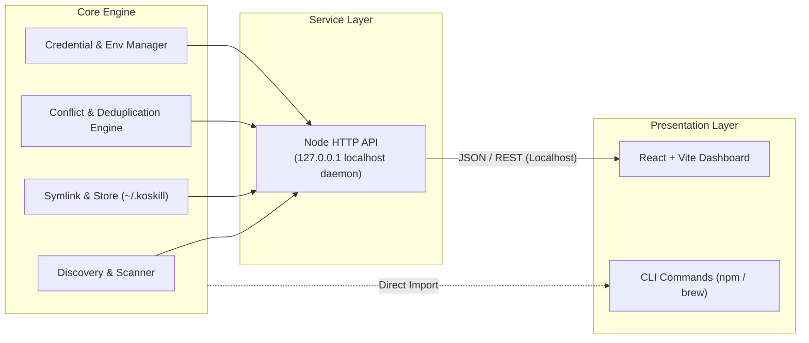

<div align="center">


# KoSkill

**A local management cockpit for AI agent skills and Model Context Protocol (MCP) servers.**

Manage, visualize, deduplicate, and symlink skills across Gemini CLI, AntiGravity, Codex, Claude Code, and Cloud Code.

[](LICENSE)
[](https://nodejs.org)
[](https://vitejs.dev)
[](https://www.typescriptlang.org)
[](docs/technical-guide.md)

[Overview](#overview) • [Architecture](#architecture) • [Features](#features) • [Tech Stack](#tech-stack) • [Getting Started](#getting-started) • [Documentation](#documentation)

</div>

---

## Overview

Modern AI development assistants (Gemini CLI, AntiGravity, Codex, Claude Code) store skills, prompts, and MCP tool definitions across fragmented global directories (`~/.gemini`, `~/.config`, `~/.claude`, etc.).

**KoSkill** provides a centralized control plane and local web dashboard to:
- Discover all installed skills and MCP servers in one unified place.
- Detect duplicate capabilities and naming conflicts.
- Pick preferred tool versions or merge overlapping configs.
- Consolidate configurations into a central home (`~/.koskill`) with automated symlinking.
- Safely manage API credentials without leaving plaintext secrets in unmanaged directories.

---

## Architecture

KoSkill isolates domain logic from presentation layers. The core application services operate independently from the frontend, ensuring the tool can be packaged as an npm CLI first and extended with native terminal commands or Homebrew distribution later.



### Architectural Guarantees

- **Decoupled Core**: Application logic lives in shared core services, not inside React components.
- **Local Security**: Node HTTP daemon binds strictly to `127.0.0.1`, keeping tools and credentials isolated from LAN interfaces.
- **Low Overhead**: Lightweight local Node runtime with negligible resource impact.
- **Clean Distribution**: Ships as an npm CLI utility first (`npx koskill`), with Homebrew formula support planned.

---

## Features

- **Global Discovery**: Automatically scan global and workspace configurations from Gemini CLI, AntiGravity (AGY), Codex, Claude Code, and Cloud Code for skills, custom workflows, and MCP servers.
- **Workflow & Slash Command Support**: Discover and inspect custom slash commands across Gemini CLI (`~/.gemini/config/global_workflows/`, `.agent/workflows/`) and Claude Code (`~/.claude/commands/`, `.claude/commands/`) with dedicated syntax hints and permission views.
- **Central Storage & Symlinking**: Consolidate scattered configurations into `~/.koskill/` and manage symlinks to target environments transparently. User can pick and choose which one they want to leave in the original config or move / symlink to ~/.koskill
- **Conflict & Duplicate Detection**: Identify conflicting instructions, duplicate MCP tools, and name collisions across ecosystems.
- **Resolution Workflows**: Interactively choose preferred definitions, set workspace overrides, or merge complementary configs.
- **Instant Activation Toggles**: Enable or disable specific skills and MCP servers globally or on a per-project basis with a single click.
- **Backup & Migration**: Export your curated skill set and restore it on new development machines effortlessly.
- **Credential & API Key Safety**: Manage sensitive API keys and tokens in a secure local vault rather than spreading them across plain text files.

---

## Tech Stack

- **Frontend**: React, TypeScript, Vite
- **Backend API**: Node.js HTTP Server (strictly bound to `127.0.0.1`)
- **Core Engine**: TypeScript modular services
- **Distribution**: npm CLI package (`npx koskill`), optional Homebrew tap planned
- **Storage**: Local filesystem (`~/.koskill`, system config directories)

---

## Project Structure

```text
koskill/
├── .agent/                    # Agent workflows and custom skill definitions
├── docs/                      # Architectural, design, and user guides
├── log/                       # Operational and agent trace logs
│   └── agent.log              # Agent run and structured logs
├── openspec/                  # Spec-driven development changes and specs
├── _tickets/                  # Task tracking (pending and completed)
├── src/                       # Source codebase
│   ├── core/                  # Core domain models, contracts, and logger
│   │   ├── scanner/           # Discovery scanner for Gemini and Claude
│   │   ├── logger.ts          # Centralized structured logger
│   │   └── types.ts           # Shared domain types and type guards
│   ├── server/                # Node.js HTTP daemon
│   │   ├── routes/            # REST API route handlers
│   │   └── index.ts           # Server entrypoint and health route
│   └── client/                # Vite + React frontend dashboard
│       ├── index.html         # Frontend HTML entrypoint
│       └── src/               # React components, styles, and tests
├── tests/                     # Automated unit, route, and component tests
├── AGENTS.md                  # Operational rules and coding invariants for AI agents
├── CHANGELOG.md               # Release notes following Keep a Changelog
├── package.json               # Root workspace manifest and scripts
├── tsconfig.json              # TypeScript strict configuration
├── vite.config.ts             # Vite build and Vitest configuration
└── README.md                  # Project overview and documentation index
```

---

## Getting Started

### Prerequisites

- [Node.js](https://nodejs.org) (v18.0.0 or higher recommended)
- `npm`

### Quick Start (CLI)

```bash
# Launch the local dashboard via npx
npx koskill
```

### Local Development Setup

Clone the repository and start the local development environment:

```bash
git clone https://github.com/korakot/koskill.git
cd koskill

# Install dependencies
npm install

# Start development server (Node API on port 3900 + Vite frontend on port 5173)
npm run dev
```

Open your browser to `http://localhost:5173` to access the local dashboard.

---

## Development & Verification

Before submitting pull requests, ensure your changes pass all local verification gates:

```bash
# Run code linting
npm run lint

# Execute test suite
npm test

# Build production bundle
npm run build
```

---

## Documentation

Comprehensive project documentation is maintained in the [`docs/`](docs/) directory:

- [Technical & Architecture Guide](docs/technical-guide.md): Deep dive into system design, core contracts, and security.
- [User Guide](docs/user-guide.md): Setup, configuration, discovery workflows, and feature walkthroughs.
- [Design System](docs/design.md): UI styling tokens, themes, and layout rules.
- [Project Roadmap](docs/project.md): Implementation phases and upcoming capabilities.
- [Learnings & Post-Mortems](docs/learning.md): Incident logs, technical debt tracking, and decisions.

---

## Agent & Specification Workflow

This project adheres to specification-driven pair-programming conventions:
- **Agent Rules**: Review [AGENTS.md](AGENTS.md) for architectural constraints and coding invariants.
- **Change Management**: Propose and track changes through [openspec/](openspec/) and `_tickets/`.

---

## Changelog

See [CHANGELOG.md](CHANGELOG.md) for release notes and version history.

---

## License

This project is licensed under the [MIT License](LICENSE).
