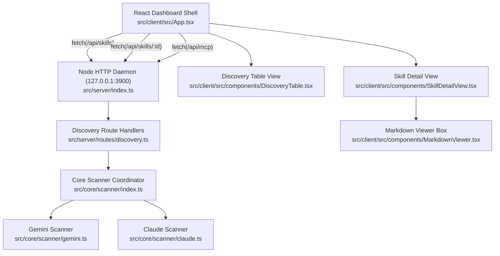

# Technical, Developer & Architecture Guide

This document provides a comprehensive technical reference for engineers, DevOps contributors, and system architects working on the codebase.

---

## Table of Contents
 
 1. [Running & Execution Instructions](#1-running--execution-instructions)
 2. [High-Level Architecture & Modular Target Graph](#2-high-level-architecture--modular-target-graph)
 3. [Core Discovery Scanner Service](#3-core-discovery-scanner-service)
 4. [HTTP Daemon REST Endpoints](#4-http-daemon-rest-endpoints)
 5. [Central Storage, Symlink Managers & MCP Client](#5-central-storage-symlink-managers--mcp-client)
 6. [Hybrid Search Engine & Semantic Conflict Detection](#6-hybrid-search-engine--semantic-conflict-detection)
 7. [Frontend Presentation & Views](#7-frontend-presentation--views)
 8. [Security, Cryptography & Privacy](#8-security-cryptography--privacy)
 9. [Observability & Structured Logging](#9-observability--structured-logging)
 10. [Linting, Testing & Verification Standards](#10-linting-testing--verification-standards)

---

## 1. Running & Execution Instructions

### Prerequisites
- [Node.js](https://nodejs.org) >= 18.0.0
- `npm`

### Running the Application
To run the server daemon and Vite client concurrently:
```bash
npm run dev
```

To run only the backend daemon on port 3900:
```bash
npm run dev:server
```

To run only the frontend dev server on port 5173:
```bash
npm run dev:client
```

---

## 2. High-Level Architecture & Modular Target Graph



---

## 3. Core Discovery Scanner Service

The scanner functions as an isolated domain service inside `src/core/scanner/`:

- **Gemini Scanner (`gemini.ts`)**:
  - Traverses `~/.gemini/config/skills/` and `.agents/skills/`.
  - Extracts YAML frontmatter attributes (`name`, `description`) and raw markdown from `SKILL.md`.
  - Parses `~/.gemini/config/mcp_config.json` for declared MCP servers.
- **Claude Scanner (`claude.ts`)**:
  - Parses `~/.claude/settings.json` for configured skills.
  - Parses `~/.claude/mcp.json` for active MCP servers.
- **Workflow Scanner (`workflows.ts`)**:
  - Traverses Gemini global workflows (`~/.gemini/config/global_workflows/`) and workspace workflows (`.agent/workflows/`, `.agents/workflows/`).
  - Traverses Claude custom commands (`~/.claude/commands/`, `.claude/commands/`).
  - Extracts frontmatter metadata (command trigger syntax, argument hints, allowed tools, model) and raw prompt instructions.
- **Scanner Coordinator (`index.ts`)**:
  - Executes parallel directory reads using `Promise.allSettled`.
  - Tolerates missing directories, unreadable files, or malformed JSON/YAML payloads without throwing unhandled exceptions.

---

## 4. HTTP Daemon REST Endpoints

The Node.js HTTP server binds strictly to `127.0.0.1:3900`:

- `GET /api/health`: Health check returning daemon status and version.
- `GET /api/skills`: Returns array of normalized `SkillManifest` records and total count.
- `GET /api/skills/:id`: Returns specific skill record including `rawContent` and parsed metadata. Returns 404 if not found.
- `GET /api/mcp`: Returns array of normalized `McpServerManifest` records and total count.
- `GET /api/workflows`: Returns array of normalized `WorkflowManifest` records and total count.
- `GET /api/workflows/:id`: Returns specific workflow record including `rawContent`, command trigger, argument hint, and tool permissions. Returns 404 if not found.
- `POST /api/skills/:id/centralize`: Migrates a skill directory into `~/.koskill/skills/<name>` and replaces the original directory with a symbolic link.
- `POST /api/skills/:id/revert`: Removes the symbolic link and restores physical skill files back to the original source location.
- `POST /api/skills/batch/centralize`: Accepts `{ skillIds: string[] }` and executes sequential centralization with atomic rollback per item.
- `POST /api/skills/batch/revert`: Accepts `{ skillIds: string[] }` and executes sequential reversion with error isolation.
- `POST /api/workflows/:id/centralize`: Migrates a standalone workflow markdown file into `~/.koskill/workflows/<name>.md` and creates a symlink in its place.
- `POST /api/workflows/:id/revert`: Reverts a centralized workflow symlink back to a standalone local markdown file.
- `POST /api/workflows/batch/centralize`: Accepts `{ workflowIds: string[] }` and centralizes multiple workflows sequentially.
- `POST /api/mcp/:name/centralize`: Registers an MCP server into `~/.koskill/mcp/servers.json`.
- `POST /api/mcp/:name/toggle`: Toggles the enabled state of an MCP server (`{ enabled: boolean }`).
- `POST /api/mcp/:name/query-tools`: Connects to an MCP server process over stdio via JSON-RPC 2.0 (`initialize` + `tools/list`), discovers available tools, updates `declaredToolsCount`, and caches them in `~/.koskill/mcp/servers.json`.
- `POST /api/mcp/:name/discover`: Proactively probes an MCP server over stdio using `server/discover` (with fallback to `initialize` and local `instructions.md`), extracting title, version, description, instructions, and tools.
- `POST /api/mcp/discover-all`: Probes all active MCP servers in batch with concurrency pooling, persisting enriched metadata in the central registry.
- `POST /api/mcp/generate-subset`: Generates `agents_mcp/servers.json` containing only enabled MCP servers.
- `GET /api/search/query`: Executes hybrid vector + lexical search queries (`?q=<query>&limit=<n>&itemType=<type>&ecosystem=<eco>`) returning RRF-ranked results.
- `POST /api/search/reindex`: Triggers incremental re-indexing of all discovered skills and workflows into `~/.koskill/cache/index.db`.

---

## 5. Central Storage, Symlink Managers & MCP Client

The core system manages the `~/.koskill/` hierarchy and active runtime communication:

- **MCP Client & Stdio Runner (`mcp-client.ts`, `stdio-runner.ts`)**: Spawns local MCP server commands over stdio, conducts JSON-RPC 2.0 protocol discovery (`server/discover`) with legacy handshake fallback (`initialize`, `notifications/initialized`, `tools/list`), and enforces strict process timeouts and kill sequences.
- **MCP Discovery Service (`mcp-discovery-service.ts`)**: Orchestrates single-server and batch discovery tasks with in-flight deduplication and worker pooling.
- **Store Coordinator (`store.ts`)**: Idempotently initializes `~/.koskill/skills/`, `~/.koskill/workflows/`, and `~/.koskill/mcp/` directories with safe permissions.
- **Skill Symlink Manager (`symlink-manager.ts`)**: Executes two-phase copy, backup, atomic symlink generation, and reversible rollback routines for directory-based skill migrations.
- **Workflow Symlink Manager (`workflow-symlink-manager.ts`)**: Executes atomic migration and symlinking for standalone workflow `.md` files.
- **MCP Registry Store (`mcp-store.ts`)**: Maintains canonical server declarations in `~/.koskill/mcp/servers.json`, supports server activation toggling, metadata updates (`updateServerDiscoveryMetadata`), tool schema caching, local `instructions.md` loading, and exports subsets into `agents_mcp/servers.json`.
- **Transaction Journal (`journal.ts`)**: Appends atomic transaction records to `~/.koskill/journal.json` with status tracking (`COMPLETED`, `FAILED`, `ROLLED_BACK`).

---

## 6. Hybrid Search Engine & Semantic Conflict Detection

The hybrid search layer provides embedded vector and lexical search capabilities at `~/.koskill/cache/index.db`:

- **Database Manager (`db.ts`)**: Initializes SQLite in WAL mode with `better-sqlite3`, dynamically loading the `sqlite-vec` extension and provisioning `items_meta`, `items_vec` (384-dimensional cosine distance), and `items_fts` (FTS5 BM25). Gracefully degrades to pure FTS5 if vector extensions are unavailable.
- **Local Embedder (`embedder.ts`)**: Generates normalized 384-dimensional dense vectors using `@xenova/transformers` with ONNX models (`all-MiniLM-L6-v2`). Lazily loads weights on demand to maintain sub-200ms daemon cold-start performance.
- **Incremental Indexer (`indexer.ts`)**: Synchronizes scanned skills and workflows into SQLite. Computes deterministic SHA-256 CAS content hashes to skip unmodified records, cutting re-index times to milliseconds.
- **Hybrid Search & RRF Scorer (`hybrid.ts`)**: Combines vector KNN distance and lexical BM25 rank using scale-invariant Reciprocal Rank Fusion:
  $$RRF(d) = \sum_{m \in \{vec, fts\}} \frac{1}{k + rank_m(d)} \quad (k=60)$$
- **Semantic Conflict Detector (`semantic.ts`)**: Evaluates vector similarity across skills to detect functional duplicates with differing titles (cosine similarity >= 0.85) and flags prompt instruction collisions for shared command triggers.
- **Capability Router (`routeCapabilities`)**: Discovers and ranks top-K relevant skills and workflows matching user queries in under 30ms.

---

## 7. Frontend Presentation & Views

The React client adopts the GitHub Primer design system:

- **Dashboard Shell (`App.tsx`)**: Header status indicator (`● Connected to 127.0.0.1:3900`), manual refresh action, light/dark theme toggle, and UnderlineNav tabs (Skills, Workflows, MCP Servers, Conflicts, Settings).
- **Discovery Table (`DiscoveryTable.tsx`)**: Instant client-side filtering across skill and workflow names, commands, ecosystems, and paths, with badge indicators and multi-select centralization toolbars.
- **Skill Detail View (`SkillDetailView.tsx`)**: Dedicated inspection view featuring `← Back to Discovery` breadcrumb navigation, two-column responsive layout, and metadata summary card with bold frontmatter formatting.
- **Workflow Detail View (`WorkflowDetailView.tsx`)**: Dedicated inspection view featuring invocation syntax display, argument hints, tool permission badges, Centralize/Revert action triggers, and raw prompt instruction panel.
- **MCP Server List (`McpServerList.tsx`)**: Inventory of configured MCP servers with titles, version badges, description snippets, quick "Discover" actions with spinner states, activation toggle buttons, and an action bar to generate `agents_mcp/servers.json`.
- **MCP Detail View (`McpDetailView.tsx`)**: Dedicated inspection view featuring Server Overview card, Agent Instructions markdown viewer, tool capability tables (`McpToolsTable.tsx`), runtime command/args, transport type, and interactive "Discover Server" action.
- **Markdown Viewer (`MarkdownViewer.tsx`)**: Primer README-style container rendering `SKILL.md` and workflow markdown via `marked`, featuring clean frontmatter extraction and bold key/normal text styling.


---

## 8. Security, Cryptography & Privacy

- **Localhost Binding**: All HTTP services bind strictly to `127.0.0.1` to prevent LAN exposure.
- **Read-Only Inspection**: Discovery scanning performs strictly read-only filesystem reads.
- **No Plaintext Logging**: Secrets and authentication tokens inside MCP configs are not output to logs.

---

## 9. Observability & Structured Logging

Centralized structured logger outputs timestamped JSON messages to `log/agent.log`:
- Scanned counts and warnings for corrupted configuration files.
- Unhandled routing errors and daemon lifecycle events.

---

## 10. Linting, Testing & Verification Standards

All code is strictly typed and verified through Vitest:
- `npm run lint`: TypeScript strict type check (`tsc --noEmit`).
- `npm test`: Executes all unit and integration test suites.
- `npm run build`: Verifies clean production bundling with Vite.
