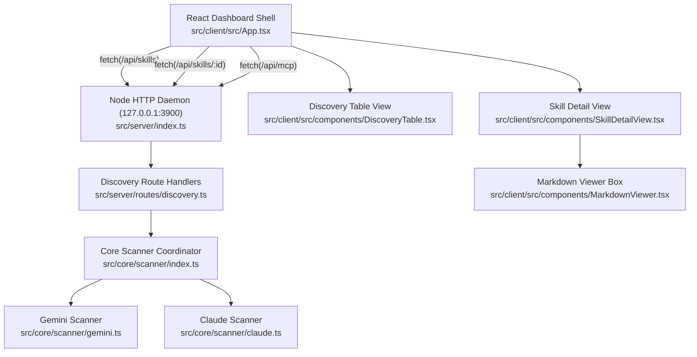
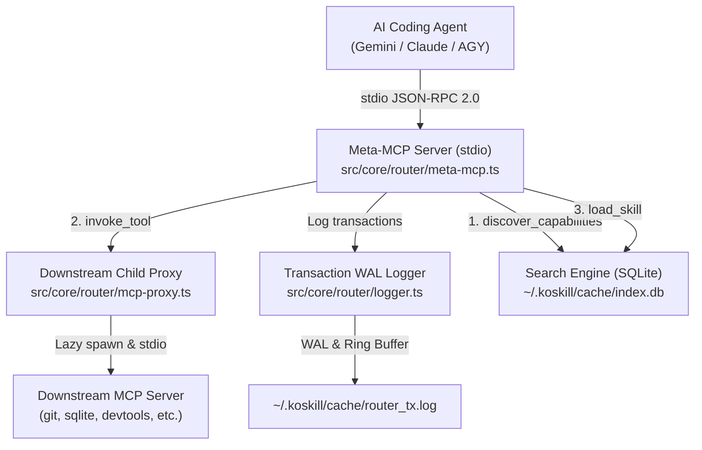

# Technical, Developer & Architecture Guide

This document provides a comprehensive technical reference for engineers, DevOps contributors, and system architects working on the codebase.

---

## Table of Contents
 
 1. [Running & Execution Instructions](#1-running--execution-instructions)
 2. [High-Level Architecture & Modular Target Graph](#2-high-level-architecture--modular-target-graph)
 3. [Core Discovery Scanner Service](#3-core-discovery-scanner-service)
 4. [HTTP Daemon REST Endpoints](#4-http-daemon-rest-endpoints)
 5. [Central Storage, Symlink Managers & MCP Client](#5-central-storage-symlink-managers--mcp-client)
 6. [Hybrid Search Engine & Semantic Conflict Detection](#6-hybrid-search-engine--semantic-conflict-detection)
 7. [Frontend Presentation & Views](#7-frontend-presentation--views)
 8. [Activation Toggles, Backup Packaging & Credential Vault](#8-activation-toggles-backup-packaging--credential-vault)
 9. [Auto-Router & Meta-MCP Server Architecture](#9-auto-router--meta-mcp-server-architecture)
 10. [Security, Cryptography & Privacy](#10-security-cryptography--privacy)
 11. [Observability & Structured Logging](#11-observability--structured-logging)
 12. [Linting, Testing & Verification Standards](#12-linting-testing--verification-standards)

---

## 1. Running & Execution Instructions

### Prerequisites
- [Node.js](https://nodejs.org) >= 18.0.0
- `npm`

### Running the Application
To run the server daemon and Vite client concurrently in development:
```bash
npm run dev
```

To build production bundles and test the standalone executable:
```bash
# Build Vite client assets into dist/client/ and compile types
npm run build

# Run the standalone executable CLI directly
./bin/koskill

# Or run without opening browser
./bin/koskill --no-open
```

To run only the backend daemon on port 3900:
```bash
npm run dev:server
```

To run only the frontend dev server on port 5173:
```bash
npm run dev:client
```

### Production Packaging & Port Allocation
- **CLI Wrapper (`bin/koskill`)**: Standalone executable shebang (`#!/usr/bin/env node`) that isolates the user workspace (`process.cwd()`) from package assets (`import.meta.url`).
- **Dynamic Port Allocation (`src/server/port.ts`)**: Probes port 3900 on `127.0.0.1`. If occupied, dynamically scans consecutive fallback ports (3901..3910).
- **Embedded Static Asset Middleware (`src/server/static.ts`)**: Serves bundled production assets from `dist/client/` with SPA routing fallback to `index.html`.
- **Homebrew Formula (`Formula/koskill.rb`)**: Supports packaging and distribution via custom Homebrew taps (`brew install koskill`).

---

## 2. High-Level Architecture & Modular Target Graph



---

## 3. Core Discovery Scanner Service

The scanner functions as an isolated domain service inside `src/core/scanner/`:

- **Gemini Scanner (`gemini.ts`)**:
  - Traverses `~/.gemini/config/skills/` and `.agents/skills/`.
  - Extracts YAML frontmatter attributes (`name`, `description`) and raw markdown from `SKILL.md`.
  - Parses `~/.gemini/config/mcp_config.json` for declared MCP servers.
- **Claude Scanner (`claude.ts`)**:
  - Parses `~/.claude/settings.json` for configured skills.
  - Parses `~/.claude/mcp.json` for active MCP servers.
- **Workflow Scanner (`workflows.ts`)**:
  - Traverses Gemini global workflows (`~/.gemini/config/global_workflows/`) and workspace workflows (`.agent/workflows/`, `.agents/workflows/`).
  - Traverses Claude custom commands (`~/.claude/commands/`, `.claude/commands/`).
  - Extracts frontmatter metadata (command trigger syntax, argument hints, allowed tools, model) and raw prompt instructions.
- **Scanner Coordinator (`index.ts`)**:
  - Executes parallel directory reads using `Promise.allSettled`.
  - Tolerates missing directories, unreadable files, or malformed JSON/YAML payloads without throwing unhandled exceptions.

---

## 4. HTTP Daemon REST Endpoints

The Node.js HTTP server binds strictly to `127.0.0.1:3900`:

- `GET /api/health`: Health check returning daemon status and version.
- `GET /api/skills`: Returns array of normalized `SkillManifest` records and total count.
- `GET /api/skills/:id`: Returns specific skill record including `rawContent` and parsed metadata. Returns 404 if not found.
- `GET /api/mcp`: Returns array of normalized `McpServerManifest` records and total count.
- `GET /api/workflows`: Returns array of normalized `WorkflowManifest` records and total count.
- `GET /api/workflows/:id`: Returns specific workflow record including `rawContent`, command trigger, argument hint, and tool permissions. Returns 404 if not found.
- `POST /api/skills/:id/centralize`: Migrates a skill directory into `~/.koskill/skills/<name>` and replaces the original directory with a symbolic link.
- `POST /api/skills/:id/revert`: Removes the symbolic link and restores physical skill files back to the original source location.
- `POST /api/skills/batch/centralize`: Accepts `{ skillIds: string[] }` and executes sequential centralization with atomic rollback per item.
- `POST /api/skills/batch/revert`: Accepts `{ skillIds: string[] }` and executes sequential reversion with error isolation.
- `POST /api/workflows/:id/centralize`: Migrates a standalone workflow markdown file into `~/.koskill/workflows/<name>.md` and creates a symlink in its place.
- `POST /api/workflows/:id/revert`: Reverts a centralized workflow symlink back to a standalone local markdown file.
- `POST /api/workflows/batch/centralize`: Accepts `{ workflowIds: string[] }` and centralizes multiple workflows sequentially.
- `POST /api/mcp/:name/centralize`: Registers an MCP server into `~/.koskill/mcp/servers.json`.
- `POST /api/mcp/:name/revert`: Reverts a centralized MCP server by removing it from `~/.koskill/mcp/servers.json`, returning its status back to `original`.
- `POST /api/mcp/:name/toggle`: Toggles the enabled state of an MCP server (`{ enabled: boolean }`).
- `POST /api/mcp/:name/query-tools`: Connects to an MCP server process over stdio via JSON-RPC 2.0 (`initialize` + `tools/list`), discovers available tools, updates `declaredToolsCount`, and caches them in `~/.koskill/mcp/servers.json`.
- `POST /api/mcp/:name/discover`: Proactively probes an MCP server over stdio using `server/discover` (with fallback to `initialize` and local `instructions.md`), extracting title, version, description, instructions, and tools.
- `POST /api/mcp/discover-all`: Probes all active MCP servers in batch with concurrency pooling, persisting enriched metadata in the central registry.
- `POST /api/mcp/generate-subset`: Generates `agents_mcp/servers.json` containing only enabled MCP servers.
- [x] `GET /api/search/query`: Executes hybrid vector + lexical search queries (`?q=<query>&limit=<n>&itemType=<type>&ecosystem=<eco>`) returning RRF-ranked results.
- `POST /api/search/reindex`: Triggers incremental re-indexing of all discovered skills and workflows into `~/.koskill/cache/index.db`.
- `GET /api/conflicts`: Executes tiered conflict detection (exact name/hash, semantic duplicate, command divergence, MCP tools) and returns structured conflict reports.
- `POST /api/conflicts/resolve`: Executes atomic conflict resolution (`PICK`, `ALIAS`, `MERGE`) with optimistic CAS hash checks and pre-resolution archiving.
- `GET /api/router/logs`: Queries transaction log ring buffer (`~/.koskill/cache/router_tx.log`) with pagination (`?limit=50&offset=0`).
- `GET /api/router/status`: Returns Auto-Router activation state, active child processes, tool counts, and cumulative metrics (total transactions, token savings, average latency).
- `POST /api/router/toggle`: Reversibly enables or disables Auto-Router prompt injection and symlink state (`{ enabled: boolean, dryRun?: boolean }`).
- `GET /api/router/stream`: Real-time Server-Sent Events (SSE) telemetry stream pushing live transaction events to the UI dashboard.

---

## 5. Central Storage, Symlink Managers & MCP Client

The core system manages the `~/.koskill/` hierarchy and active runtime communication:

- **MCP Client & Stdio Runner (`mcp-client.ts`, `stdio-runner.ts`)**: Spawns local MCP server commands over stdio, conducts JSON-RPC 2.0 protocol discovery (`server/discover`) with legacy handshake fallback (`initialize`, `notifications/initialized`, `tools/list`), and enforces strict process timeouts and kill sequences.
- **MCP Discovery Service (`mcp-discovery-service.ts`)**: Orchestrates single-server and batch discovery tasks with in-flight deduplication and worker pooling.
- **Store Coordinator (`store.ts`)**: Idempotently initializes `~/.koskill/skills/`, `~/.koskill/workflows/`, and `~/.koskill/mcp/` directories with safe permissions.
- **Skill Symlink Manager (`symlink-manager.ts`)**: Executes two-phase copy, backup, atomic symlink generation, and reversible rollback routines for directory-based skill migrations.
- **Workflow Symlink Manager (`workflow-symlink-manager.ts`)**: Executes atomic migration and symlinking for standalone workflow `.md` files.
- **MCP Registry Store (`mcp-store.ts`)**: Maintains canonical server declarations in `~/.koskill/mcp/servers.json`, supports individual server centralize and revert operations (`centralizeMcpServer`, `revertMcpServer`), server activation toggling, metadata updates (`updateServerDiscoveryMetadata`), tool schema caching, local `instructions.md` loading, and exports subsets into `agents_mcp/servers.json`.
- **Transaction Journal (`journal.ts`)**: Appends atomic transaction records to `~/.koskill/journal.json` with status tracking (`COMPLETED`, `FAILED`, `ROLLED_BACK`).

---

## 6. Hybrid Search Engine & Semantic Conflict Detection

The hybrid search layer provides embedded vector and lexical search capabilities at `~/.koskill/cache/index.db`:

- **Database Manager (`db.ts`)**: Initializes SQLite in WAL mode with `better-sqlite3`, dynamically loading the `sqlite-vec` extension and provisioning `items_meta`, `items_vec` (384-dimensional cosine distance), and `items_fts` (FTS5 BM25). Gracefully degrades to pure FTS5 if vector extensions are unavailable.
- **Local Embedder (`embedder.ts`)**: Generates normalized 384-dimensional dense vectors using `@xenova/transformers` with ONNX models (`all-MiniLM-L6-v2`). Lazily loads weights on demand to maintain sub-200ms daemon cold-start performance.
- **Incremental Indexer (`indexer.ts`)**: Synchronizes scanned skills, workflows, and individual MCP tools into SQLite. Computes deterministic SHA-256 CAS content hashes to skip unmodified records, cutting re-index times to milliseconds.
- **Index Synchronization Service (`sync.ts`)**: Orchestrates unified batch synchronization across scanned inventories and central registries (`servers.json`), populating vector embeddings and lexical tables for all capabilities.
- **Hybrid Search & RRF Scorer (`hybrid.ts`)**: Combines vector KNN distance and lexical BM25 rank using scale-invariant Reciprocal Rank Fusion:
  $$RRF(d) = \sum_{m \in \{vec, fts\}} \frac{1}{k + rank_m(d)} \quad (k=60)$$
- **Semantic Conflict Detector (`semantic.ts`)**: Evaluates vector similarity across skills to detect functional duplicates with differing titles (cosine similarity >= 0.85) and flags prompt instruction collisions for shared command triggers.
- **Capability Router (`routeCapabilities`)**: Discovers and ranks top-K relevant skills, workflows, and downstream MCP tools matching user queries in under 30ms.
- **Tiered Conflict Engine (`detector.ts`, `semantic.ts`)**: Executes Tier 1 exact name and content hash checks, Tier 2 semantic duplicate checks, Tier 3 command instruction divergence checks, and MCP tool collisions across all servers.
- **Unified Diff Generator (`diff.ts`)**: Line-based LCS diff algorithm computing line additions, deletions, context blocks, and unified diff output.
- **Atomic Conflict Resolver (`resolver.ts`)**: Implements safe `PICK`, `ALIAS`, and `MERGE` actions with optimistic CAS hash validation (`E_STALE_HASH`), non-destructive archiving into `~/.koskill/archive/`, and pre-resolution snapshot backups in `~/.koskill/backups/`.

---

## 7. Frontend Presentation & Views

The React client adopts the GitHub Primer design system:

- **Dashboard Shell (`App.tsx`, `AppHeader.tsx`)**: Header status indicator (`● Connected to 127.0.0.1:3900`), manual refresh action, light/dark theme toggle, and UnderlineNav tabs (Skills, Workflows, MCP Servers, Conflicts with dynamic danger counter badge, Settings).
- **Conflict Queue (`ConflictList.tsx`)**: Displays pending conflicts with severity badges (`ERROR` red, `WARNING` amber), semantic match percentages, involved participating items, and "Review & Resolve" actions.
- **Conflict Resolution Modal (`ConflictModal.tsx`)**: Side-by-side review modal featuring unified diffs, similarity percentage indicators, and one-click `PICK` (keep preferred), `ALIAS` (rename), and `MERGE` (combine definitions) resolution triggers.
- **Diff Viewer (`DiffViewer.tsx`)**: Component rendering line-by-line additions, deletions, and percentage similarity pills.
- **Discovery Table (`DiscoveryTable.tsx`)**: Instant client-side filtering across skill and workflow names, commands, ecosystems, and paths, with badge indicators and multi-select centralization toolbars.
- **Skill Detail View (`SkillDetailView.tsx`)**: Dedicated inspection view featuring `← Back to Discovery` breadcrumb navigation, two-column responsive layout, and metadata summary card with bold frontmatter formatting.
- **Workflow Detail View (`WorkflowDetailView.tsx`)**: Dedicated inspection view featuring invocation syntax display, argument hints, tool permission badges, Centralize/Revert action triggers, and raw prompt instruction panel.
- **MCP Server List (`McpServerList.tsx`)**: Inventory of configured MCP servers with titles, version badges, description snippets, Centralize/Revert action triggers, quick "Discover" actions with spinner states, activation toggle buttons, and an action bar to generate `agents_mcp/servers.json`.
- **MCP Detail View (`McpDetailView.tsx`)**: Dedicated inspection view featuring Server Overview card, Agent Instructions markdown viewer, tool capability tables (`McpToolsTable.tsx`), Centralize / Revert to Original action buttons, runtime command/args, transport type, and interactive "Discover Server" action.
- **Backup & Restore Modal (`BackupModal.tsx`)**: Modal dialog for machine-to-machine `.tar.gz` export and import with tar-slip protection and collision alerts.
- **Credential Vault Drawer (`VaultDrawer.tsx`)**: Slide-out drawer for secure local API key configuration with masked previews and password inputs.
- **Entity Toggle Switch (`EntityToggleSwitch.tsx`)**: Reusable toggle button with optimistic status feedback across skills, workflows, and MCP servers.
- **Markdown Viewer (`MarkdownViewer.tsx`)**: Primer README-style container rendering `SKILL.md` and workflow markdown via `marked`, featuring clean frontmatter extraction and bold key/normal text styling.

---

## 8. Activation Toggles, Backup Packaging & Credential Vault

### Activation Toggle Engine (`src/core/toggle/`)
- **Filesystem-Level Guarantees**: Rather than relying purely on internal database flags, toggles modify the filesystem state (unlinking symlinks or appending `.disabled` to directory and file names). External AI agents and CLI tools inspecting paths directly will immediately ignore disabled items.
- **Unified REST API**: `POST /api/:entityType/:id/toggle` validates `:entityType` against `skills`, `workflows`, and `mcp-servers`, updates disk state, and logs the operation in `~/.koskill/journal.json`.

### Machine-to-Machine Backup & Restore (`src/core/backup/`)
- **Scoped Packaging**: Exports centralized items in `~/.koskill/` (`skills/`, `workflows/`, `mcp/`, and `journal.json`) into a gzip tarball (`.tar.gz`) along with an embedded `backup-manifest.json` recording item counts and versions.
- **Tar-Slip Prevention**: Importer validates every archive entry using `validateArchiveEntries`, rejecting any entry that contains parent path traversals (`..`), absolute roots, or resolves outside destination root.
- **Collision Safeguards**: Prevents silent overwriting of existing items during restore unless `overwrite: true` is explicitly passed.

### Local Credential Vault (`src/core/vault/`)
- **POSIX Permission Isolation**: Directory `~/.koskill/vault/` is restricted to mode `0700`, and `secrets.json` is restricted to mode `0600` (read/write limited exclusively to file owner).
- **Atomic Operations & Fallbacks**: Writes stage through temporary files (`.tmp`) and preserve existing versions as `.bak` prior to `rename`.
- **Secret Masking Invariants**: Plaintext secrets are never returned in public API payloads or written to log files; the REST API (`GET /api/vault`) returns masked strings (e.g., `sk-...48a9` or `****`).

---

## 9. Auto-Router & Meta-MCP Server Architecture

The Auto-Router subsystem (`src/core/router/`) provides a lightweight Meta-MCP server layer over stdio that replaces dozens of registered agent tools with three dynamic meta-tools:



### Core Subsystem Components

- **Meta-MCP Server (`meta-mcp.ts`)**:
  - Implements stdio JSON-RPC 2.0 server lifecycle (`initialize`, `notifications/initialized`, `ping`, `tools/list`, `tools/call`).
  - Strict JSON-RPC 2.0 notification compliance: messages without an `id` or prefixed with `notifications/` are processed silently without emitting spurious error frames.
  - Exposes only 3 meta-tools: `discover_capabilities`, `invoke_tool`, and `load_skill`.
  - Injects category filtering and compact capability descriptors (< 150 tokens) to reduce context overhead by up to 87%.
  - Handles `load_skill` requests with frontmatter stripping and companion asset indexing (`scripts/`, `references/`, `resources/`).
- **Downstream MCP Proxy & Pool (`mcp-proxy.ts`, `pid-tracker.ts`)**:
  - Lazily spawns downstream MCP server processes on demand via `child_process.spawn`.
  - Restricts pool concurrency to a maximum of 5 simultaneous child processes.
  - Automatically reclaims idle processes after 5 minutes of inactivity using an LRU eviction strategy.
  - Enforces a strict 15-second per-call execution timeout via `AbortController`.
  - Filters out non-JSON stdout debug lines to prevent JSON-RPC parser crashes.
  - Tracks child process PIDs in `~/.koskill/cache/pids.json` and cleanly handles `SIGINT` / `SIGTERM` signals.
- **Transaction Logger & Ring Buffer (`logger.ts`)**:
  - Appends every routed transaction to an append-only WAL file at `~/.koskill/cache/router_tx.log`.
  - Maintains an in-memory circular ring buffer truncated at the most recent 1,000 transactions.
  - Computes dynamic token savings:
    $$\text{Token Savings} = (\text{Registered Tools} \times 200) - (3 \times 200 + \text{Discovered Capabilities} \times 15)$$
- **Reversible Router Toggle (`toggle-router.ts`)**:
  - Automatically registers `"koskill-router"` into active agent configurations (`~/.gemini/antigravity-ide/mcp_config.json`, `~/.gemini/config/mcp_config.json`, `~/.claude/mcp.json`).
  - Partitions MCP servers into two tiers:
    - **Centralized MCP Servers** (managed by KoSkill in `~/.koskill/mcp/servers.json`): Moved downstream by marking them `disabled: true` and `_koskillDownstream: true`, delegating execution to the router proxy.
    - **Normal MCP Servers** (unmanaged original servers): Left active and unmodified so they remain directly available in AGY-IDE and coding assistants.
  - Safely injects and strips prompt guidance blocks (`<!-- KOSKILL_ROUTER_START -->`) into `~/.gemini/GEMINI.md` and `~/.claude/CLAUDE.md`.
  - Manages skill symlink `.disabled` renaming.
  - Supports dry-run execution preview returning exact filesystem operations before committing changes.
- **CLI Runner & Binary (`bin/koskill`, `src/cli/commands/router.ts`, `src/cli/index.ts`)**:
  - `bin/koskill` provides a zero-config executable CLI wrapper with dynamic `tsx` ESM loader resolution and signal forwarding (`SIGINT`, `SIGTERM`).
  - Running `npm link` exposes `koskill` on `$PATH` across agent environments.
  - Command `koskill router run` directly launches the Meta-MCP server over stdio for agent integration.

---

## 10. Security, Cryptography & Privacy

- **Localhost Binding**: All HTTP services bind strictly to `127.0.0.1` to prevent LAN exposure.
- **Read-Only Inspection**: Discovery scanning performs strictly read-only filesystem reads.
- **Credential Isolation**: Local credential vault enforces POSIX `0600` file permissions and excludes secrets from backups by default.
- **No Plaintext Logging**: Secrets and authentication tokens inside MCP configs and vault are never output to logs.

---

## 11. Observability & Structured Logging

Centralized structured logger outputs timestamped JSON messages to `log/agent.log`:
- Scanned counts and warnings for corrupted configuration files.
- Unhandled routing errors and daemon lifecycle events.
- Transaction events streamable in real-time via `GET /api/router/stream`.

---

## 12. Linting, Testing & Verification Standards

All code is strictly typed and verified through Vitest:
- `npm run lint`: TypeScript strict type check (`tsc --noEmit`).
- `npm test`: Executes all unit and integration test suites.
- `npm run build`: Verifies clean production bundling with Vite.
