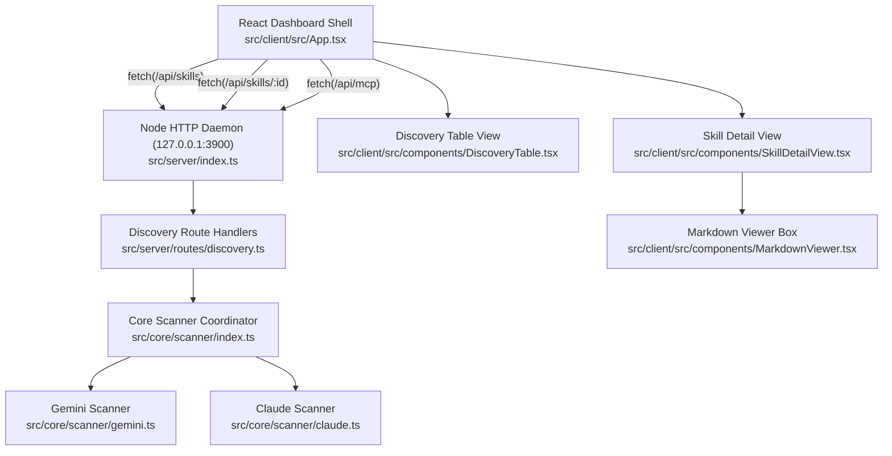

# Technical, Developer & Architecture Guide

This document provides a comprehensive technical reference for engineers, DevOps contributors, and system architects working on the codebase.

---

## Table of Contents

1. [Running & Execution Instructions](#1-running--execution-instructions)
2. [High-Level Architecture & Modular Target Graph](#2-high-level-architecture--modular-target-graph)
3. [Core Discovery Scanner Service](#3-core-discovery-scanner-service)
4. [HTTP Daemon REST Endpoints](#4-http-daemon-rest-endpoints)
5. [Frontend Presentation & Views](#5-frontend-presentation--views)
6. [Security, Cryptography & Privacy](#6-security-cryptography--privacy)
7. [Observability & Structured Logging](#7-observability--structured-logging)
8. [Linting, Testing & Verification Standards](#8-linting-testing--verification-standards)

---

## 1. Running & Execution Instructions

### Prerequisites
- [Node.js](https://nodejs.org) >= 18.0.0
- `npm`

### Running the Application
To run the server daemon and Vite client concurrently:
```bash
npm run dev
```

To run only the backend daemon on port 3900:
```bash
npm run dev:server
```

To run only the frontend dev server on port 5173:
```bash
npm run dev:client
```

---

## 2. High-Level Architecture & Modular Target Graph



---

## 3. Core Discovery Scanner Service

The scanner functions as an isolated domain service inside `src/core/scanner/`:

- **Gemini Scanner (`gemini.ts`)**:
  - Traverses `~/.gemini/config/skills/` and `.agents/skills/`.
  - Extracts YAML frontmatter attributes (`name`, `description`) and raw markdown from `SKILL.md`.
  - Parses `~/.gemini/config/mcp_config.json` for declared MCP servers.
- **Claude Scanner (`claude.ts`)**:
  - Parses `~/.claude/settings.json` for configured skills.
  - Parses `~/.claude/mcp.json` for active MCP servers.
- **Workflow Scanner (`workflows.ts`)**:
  - Traverses Gemini global workflows (`~/.gemini/config/global_workflows/`) and workspace workflows (`.agent/workflows/`, `.agents/workflows/`).
  - Traverses Claude custom commands (`~/.claude/commands/`, `.claude/commands/`).
  - Extracts frontmatter metadata (command trigger syntax, argument hints, allowed tools, model) and raw prompt instructions.
- **Scanner Coordinator (`index.ts`)**:
  - Executes parallel directory reads using `Promise.allSettled`.
  - Tolerates missing directories, unreadable files, or malformed JSON/YAML payloads without throwing unhandled exceptions.

---

## 4. HTTP Daemon REST Endpoints

The Node.js HTTP server binds strictly to `127.0.0.1:3900`:

- `GET /api/health`: Health check returning daemon status and version.
- `GET /api/skills`: Returns array of normalized `SkillManifest` records and total count.
- `GET /api/skills/:id`: Returns specific skill record including `rawContent` and parsed metadata. Returns 404 if not found.
- `GET /api/mcp`: Returns array of normalized `McpServerManifest` records and total count.
- `GET /api/workflows`: Returns array of normalized `WorkflowManifest` records and total count.
- `GET /api/workflows/:id`: Returns specific workflow record including `rawContent`, command trigger, argument hint, and tool permissions. Returns 404 if not found.

---

## 5. Frontend Presentation & Views

The React client adopts the GitHub Primer design system:

- **Dashboard Shell (`App.tsx`)**: Header status indicator (`● Connected to 127.0.0.1:3900`), manual refresh action, light/dark theme toggle, and UnderlineNav tabs (Skills, Workflows, MCP Servers, Conflicts, Settings).
- **Discovery Table (`DiscoveryTable.tsx`)**: Instant client-side filtering across skill and workflow names, commands, ecosystems, and paths, with badge indicators (`Label--accent` for Gemini, `Label--done` for Claude, `Label--secondary` for scope).
- **Skill Detail View (`SkillDetailView.tsx`)**: Dedicated inspection view featuring `← Back to Discovery` breadcrumb navigation, two-column responsive layout, and metadata summary card.
- **Workflow Detail View (`WorkflowDetailView.tsx`)**: Dedicated inspection view featuring invocation syntax display, argument hints, tool permission badges, and raw prompt instruction panel.
- **Markdown Viewer (`MarkdownViewer.tsx`)**: Primer README-style container rendering `SKILL.md` and workflow markdown via `marked`.


---

## 6. Security, Cryptography & Privacy

- **Localhost Binding**: All HTTP services bind strictly to `127.0.0.1` to prevent LAN exposure.
- **Read-Only Inspection**: Discovery scanning performs strictly read-only filesystem reads.
- **No Plaintext Logging**: Secrets and authentication tokens inside MCP configs are not output to logs.

---

## 7. Observability & Structured Logging

Centralized structured logger outputs timestamped JSON messages to `log/agent.log`:
- Scanned counts and warnings for corrupted configuration files.
- Unhandled routing errors and daemon lifecycle events.

---

## 8. Linting, Testing & Verification Standards

All code is strictly typed and verified through Vitest:
- `npm run lint`: TypeScript strict type check (`tsc --noEmit`).
- `npm test`: Executes all unit and integration test suites.
- `npm run build`: Verifies clean production bundling with Vite.
